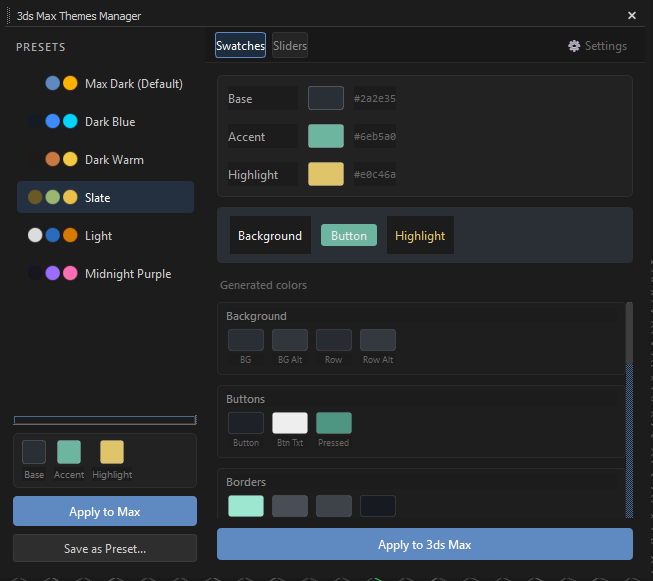

# 3ds Max Themes Manager

[](https://www.paypal.com/donate/?hosted_button_id=LAMNRY6DDWDC4)


A Python + PySide6 tool for **3ds Max 2025–2027** that lets you create and apply fully custom UI color themes — no manual XML editing required.

Pick just **3 colors** (Base, Accent, Highlight) and the tool automatically derives all ~40 Max UI color IDs using perceptually-uniform **OKLCH color math**, then writes them directly to your `MaxStartUI.clrx` and reloads the theme live — no restart needed.


---

## ✨ Features

- **3-color workflow** — choose Base, Accent, and Highlight; everything else is calculated automatically
- **Live preview** — see a mock UI preview update in real time as you pick colors
- **Two editing modes** — Color Swatches (click-to-pick) or OKLCH Sliders (Hue / Chroma / Lightness)
- **Built-in presets** — Max Dark, Dark Blue, Dark Warm, Slate, Light, Midnight Purple
- **User presets** — save, name, and reuse your own themes (persisted to `%APPDATA%`)
- **Apply live** — writes to `.clrx` and calls `colorMan.repaintUI()` inside running Max — no restart
- **Bundle install** — ships as a `.bundle` package; appears under the **MYARTSBOX** menu automatically

---

## Requirements

| | |
|---|---|
| **3ds Max** | 2025 – 2027 |
| **OS** | Windows 64-bit |
| **Python** | 3.11 (bundled with Max — no separate install) |
| **PySide6** | 6.5.x (bundled with Max — no separate install) |

---

## 📦 Installation

1. Download the latest release and extract it.
2. Copy `MABThemsManger.bundle` to one of:
   - `C:\ProgramData\Autodesk\ApplicationPlugins\` *(all users)*
   - `%APPDATA%\Autodesk\ApplicationPlugins\` *(current user only)*
3. Restart 3ds Max.
4. Go to the **MYARTSBOX** menu → click **3ds Max Themes Manager**.

---

## Usage

### Swatches Panel
Click any of the three color squares to open a color picker dialog. The read-only swatch grid below updates live to show all generated UI colors.

### Sliders Panel
Fine-tune each color using individual **Hue**, **Chroma**, and **Lightness** sliders in OKLCH space — giving smooth, perceptually accurate adjustments.

### Presets Sidebar
- **Click** a preset to preview it in both panels
- **Apply to Max** — writes and reloads the selected preset immediately
- **Save as Preset...** — saves your current colors as a named preset
- Right-click a user preset to **Delete** it

### Settings
Click **⚙ Settings** in the top bar to view version info and links.

---

## How It Works

Instead of requiring users to know 40+ color IDs, the tool derives them all from 3 seed colors using **OKLCH** (a perceptually uniform color space). Shifts in lightness, chroma, and hue are applied consistently, so your theme looks harmonious across the entire Max interface — backgrounds, buttons, borders, text, trackbar, viewports, rollups, and tabs.

The result is written to:
```
%LOCALAPPDATA%\Autodesk\3dsMax\2026 - 64bit\ENU\en-US\UI\MaxStartUI.clrx
```
and applied live via `colorMan.loadColorFile()` + `colorMan.repaintUI()`.

---

## Project Structure

```
MABThemsManger.bundle/
└── Contents/
    ├── main.py                   # entry point
    ├── theme_engine.py           # OKLCH color derivation logic
    ├── clrx_writer.py            # read/write MaxStartUI.clrx
    ├── presets.py                # built-in + user preset management
    ├── constants.py              # product metadata
    ├── mab.ThemesManager.mcr     # Max macroScript
    ├── mab.ThemesManager.ms      # MAXScript launcher
    ├── mab.ThemesManager.mnx     # menu registration
    └── ui/
        ├── main_window.py        # main window layout
        ├── swatch_tab.py         # color picker panel
        ├── slider_tab.py         # OKLCH slider panel
        ├── preset_sidebar.py     # preset list sidebar
        └── settings_dialog.py    # about / settings dialog
```

---

## License

MIT License — free to use, modify, and distribute.

---

## Support

If this tool saves you time, consider supporting its development:

[](https://www.paypal.com/donate/?hosted_button_id=LAMNRY6DDWDC4)

---

Developed by **Iman Shirani** — [MYARTSBOX](https://github.com/imanshirani)
